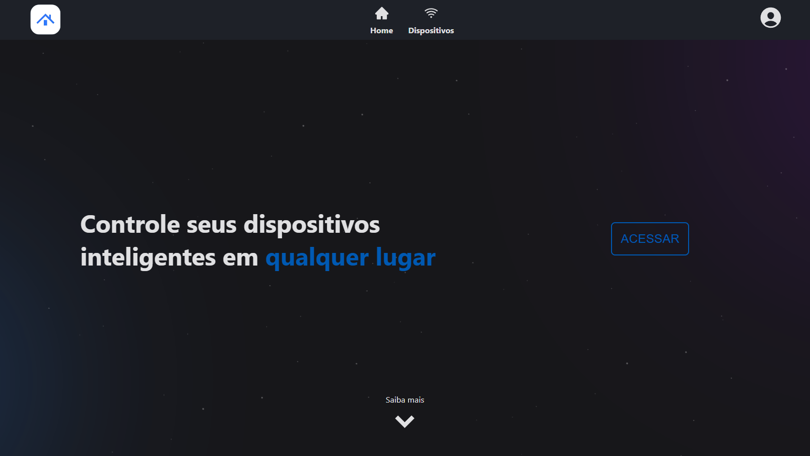

# IoT Home

A web-based IoT monitoring system developed as the final project for a Technical Degree in IT.

The main goal of this project was to create an application capable of receiving data from a physical device (ESP32 + magnetic door sensor), storing this information in a database, and displaying it through a clean and intuitive web interface.

---

## Project Overview

IoT Home was designed to allow users to monitor smart home devices by tracking real-time events, such as door opening and closing, through a web dashboard.

This version was developed as an MVP (Minimum Viable Product), focused on a single door sensor, but the original concept included support for multiple devices and future alarm system integration.

---

## Features

- User authentication (login)
- Sensor event dashboard
- Door open/close logs with timestamps
- Data persistence using PostgreSQL
- IoT device integration via HTTP API
- Responsive web interface

---

## Tech Stack

### Front-end
- React

### Back-end / Database
- Prisma
- PostgreSQL

### Hardware / IoT
- ESP32
- Magnetic door sensor (reed switch)
- HTTP communication

---

## System Architecture

```text
Magnetic Door Sensor
        ↓
      ESP32
        ↓ (HTTP Request)
       API
        ↓
   PostgreSQL
        ↓
 React Front-end
```

---

## Main Technical Challenge

The biggest challenge in this project was integrating hardware and software components:

- reading sensor events from the ESP32;
- sending data through an HTTP API;
- storing events in the database;
- displaying logs in a user-friendly interface.

This required combining embedded systems concepts with full-stack web development.

---

## Screenshot

### Main screen


---

## Team

Developed in a team of two as the final project for a Technical Degree in IT.

My main contributions:
- React front-end development
- database and front-end integration
- support on ESP32/system integration

---